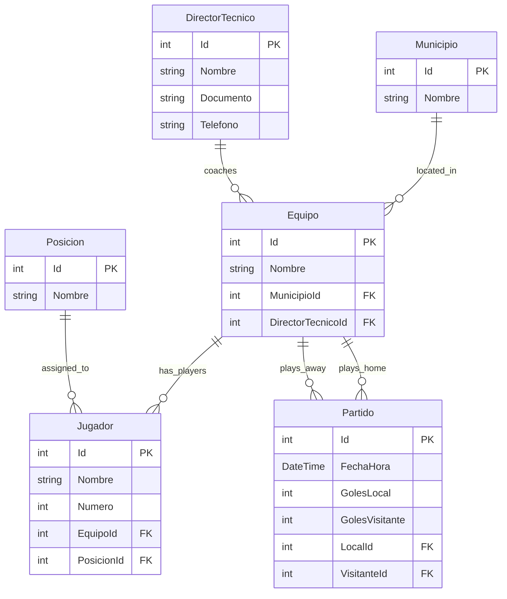

## Overview

The Tournament Management App uses Entity Framework Core with support for both SQLite (default) and SQL Server databases. The application maintains two separate database contexts for different purposes.

## Database Contexts

The application uses two Entity Framework Core contexts:

<CardGroup cols={2}>
  <Card title="DataContext" icon="database">
    **Purpose**: Tournament domain data
    
    **Entities**:
    - Municipios (Municipalities)
    - DirectoresTecnicos (Technical Directors)
    - Equipos (Teams)
    - Jugadores (Players)
    - Partidos (Matches)
    - Posiciones (Positions)
  </Card>
  
  <Card title="IdentityDataContext" icon="lock">
    **Purpose**: User authentication
    
    **Entities**:
    - AspNetUsers
    - AspNetRoles
    - AspNetUserClaims
    - AspNetRoleClaims
    - DataProtectionKeys
  </Card>
</CardGroup>

## Database Providers

### SQLite (Default)

SQLite is the default database provider, ideal for development and small deployments:

**Advantages**:
- No separate database server required
- File-based storage
- Zero configuration
- Perfect for development and testing

**Connection String**:
```csharp Program.cs
var connectionString = Environment.GetEnvironmentVariable("DATABASE_CONNECTION_STRING") 
    ?? "Data Source=/app/Torneo.db";
```

The database file is created automatically at `/app/Torneo.db` inside the Docker container, or in the application directory for local development.

### SQL Server

For production deployments with higher load, you can use SQL Server:

**Advantages**:
- Better performance at scale
- Advanced features (stored procedures, full-text search)
- Enterprise support and tooling
- Concurrent access handling

**Configuration**:

<Steps>
  <Step title="Set environment variable">
    ```bash
    export DATABASE_CONNECTION_STRING="Server=localhost;Database=TorneoDb;User Id=sa;Password=YourPassword123!;TrustServerCertificate=True;"
    ```
  </Step>

  <Step title="Update DbContext configuration">
    The application automatically detects SQL Server connection strings. No code changes needed.
  </Step>

  <Step title="Run migrations">
    ```bash
    dotnet ef database update --project Torneo.App.Persistencia --startup-project Torneo.App.Frontend --context Torneo.App.Persistencia.DataContext
    
    dotnet ef database update --project Torneo.App.Frontend --context Torneo.App.Frontend.Areas.Identity.Data.IdentityDataContext
    ```
  </Step>
</Steps>

## Initial Setup

### Docker Deployment (Automatic)

When using Docker, migrations run automatically during image build:

```dockerfile Dockerfile (lines 19-35)
# DataContext migrations
RUN dotnet ef migrations add InitialCreate \
    --project Torneo.App.Persistencia/Torneo.App.Persistencia.csproj \
    --startup-project Torneo.App.Frontend/Torneo.App.Frontend.csproj \
    --context Torneo.App.Persistencia.DataContext \
    --no-build --configuration Release \
&& dotnet ef database update \
    --project Torneo.App.Persistencia/Torneo.App.Persistencia.csproj \
    --startup-project Torneo.App.Frontend/Torneo.App.Frontend.csproj \
    --context Torneo.App.Persistencia.DataContext

# IdentityDataContext migrations  
RUN dotnet ef migrations add CreateIdentitySchema \
    --project Torneo.App.Frontend/Torneo.App.Frontend.csproj \
    --context Torneo.App.Frontend.Areas.Identity.Data.IdentityDataContext \
    --no-build --configuration Release \
&& dotnet ef database update \
    --project Torneo.App.Frontend/Torneo.App.Frontend.csproj \
    --startup-project Torneo.App.Frontend/Torneo.App.Frontend.csproj \
    --context Torneo.App.Frontend.Areas.Identity.Data.IdentityDataContext
```

The database is fully initialized when the container starts.

### Local Development (Manual)

For local development without Docker:

<Steps>
  <Step title="Install Entity Framework Tools">
    ```bash
    dotnet tool install --global dotnet-ef --version 8.0.0
    ```
    
    Verify installation:
    ```bash
    dotnet ef --version
    ```
  </Step>

  <Step title="Navigate to the repository">
    ```bash
    cd Tournament-Management-App/Torneo.App
    ```
  </Step>

  <Step title="Create DataContext migrations">
    ```bash
    dotnet ef migrations add InitialCreate \
      --project Torneo.App.Persistencia/Torneo.App.Persistencia.csproj \
      --startup-project Torneo.App.Frontend/Torneo.App.Frontend.csproj \
      --context Torneo.App.Persistencia.DataContext
    ```
  </Step>

  <Step title="Apply DataContext migrations">
    ```bash
    dotnet ef database update \
      --project Torneo.App.Persistencia/Torneo.App.Persistencia.csproj \
      --startup-project Torneo.App.Frontend/Torneo.App.Frontend.csproj \
      --context Torneo.App.Persistencia.DataContext
    ```
  </Step>

  <Step title="Create IdentityDataContext migrations">
    ```bash
    dotnet ef migrations add CreateIdentitySchema \
      --project Torneo.App.Frontend/Torneo.App.Frontend.csproj \
      --context Torneo.App.Frontend.Areas.Identity.Data.IdentityDataContext
    ```
  </Step>

  <Step title="Apply IdentityDataContext migrations">
    ```bash
    dotnet ef database update \
      --project Torneo.App.Frontend/Torneo.App.Frontend.csproj \
      --context Torneo.App.Frontend.Areas.Identity.Data.IdentityDataContext
    ```
  </Step>

  <Step title="Run the application">
    ```bash
    cd Torneo.App.Frontend
    dotnet run
    ```
    
    The application will start on `https://localhost:5001` and `http://localhost:5000`.
  </Step>
</Steps>

## Database Schema

### Tournament Domain Tables

| Table | Description | Key Relationships |
|-------|-------------|-------------------|
| **Municipios** | Cities/municipalities where teams are based | Referenced by Equipos |
| **DirectoresTecnicos** | Technical directors (coaches) | Referenced by Equipos |
| **Equipos** | Tournament teams | References Municipio, DirectorTecnico; has many Jugadores and Partidos |
| **Jugadores** | Players on teams | References Equipo and Posicion |
| **Posiciones** | Player positions (Goalkeeper, Defender, etc.) | Referenced by Jugadores |
| **Partidos** | Matches between teams | References two Equipos (Local and Visitante) |

### Identity Tables

| Table | Description |
|-------|-------------|
| **AspNetUsers** | User accounts with email and password |
| **AspNetRoles** | User roles for authorization |
| **AspNetUserRoles** | User-to-role assignments |
| **AspNetUserClaims** | Additional user claims |
| **AspNetUserLogins** | External authentication providers |
| **DataProtectionKeys** | Encryption keys for data protection |

## Entity Relationships



## Migration Management

### List Migrations

View applied and pending migrations:

```bash
# DataContext migrations
dotnet ef migrations list \
  --project Torneo.App.Persistencia \
  --startup-project Torneo.App.Frontend \
  --context Torneo.App.Persistencia.DataContext

# IdentityDataContext migrations
dotnet ef migrations list \
  --project Torneo.App.Frontend \
  --context Torneo.App.Frontend.Areas.Identity.Data.IdentityDataContext
```

### Create New Migration

When you modify entity models:

```bash
# Create migration for domain changes
dotnet ef migrations add <MigrationName> \
  --project Torneo.App.Persistencia \
  --startup-project Torneo.App.Frontend \
  --context Torneo.App.Persistencia.DataContext

# Apply the migration
dotnet ef database update \
  --project Torneo.App.Persistencia \
  --startup-project Torneo.App.Frontend \
  --context Torneo.App.Persistencia.DataContext
```

### Rollback Migration

To undo the last migration:

```bash
# Rollback to previous migration
dotnet ef database update <PreviousMigrationName> \
  --project Torneo.App.Persistencia \
  --startup-project Torneo.App.Frontend \
  --context Torneo.App.Persistencia.DataContext

# Remove migration file
dotnet ef migrations remove \
  --project Torneo.App.Persistencia \
  --startup-project Torneo.App.Frontend \
  --context Torneo.App.Persistencia.DataContext
```

<Warning>
Rollbacks can cause data loss if the migration being removed includes `DropTable` or `DropColumn` operations. Always backup your database before rolling back migrations.
</Warning>

### Generate SQL Script

To review SQL without applying changes:

```bash
dotnet ef migrations script \
  --project Torneo.App.Persistencia \
  --startup-project Torneo.App.Frontend \
  --context Torneo.App.Persistencia.DataContext \
  --output migration.sql
```

## Database Seeding

To add initial data, you can seed the database in `DataContext.cs` using the `OnModelCreating` method:

```csharp Example Seeding
protected override void OnModelCreating(ModelBuilder modelBuilder)
{
    // Seed positions
    modelBuilder.Entity<Posicion>().HasData(
        new Posicion { Id = 1, Nombre = "Portero" },
        new Posicion { Id = 2, Nombre = "Defensa" },
        new Posicion { Id = 3, Nombre = "Mediocampista" },
        new Posicion { Id = 4, Nombre = "Delantero" }
    );
    
    // Seed municipalities
    modelBuilder.Entity<Municipio>().HasData(
        new Municipio { Id = 1, Nombre = "Medellín" },
        new Municipio { Id = 2, Nombre = "Bogotá" },
        new Municipio { Id = 3, Nombre = "Cali" }
    );
}
```

After adding seed data, create a new migration:

```bash
dotnet ef migrations add SeedInitialData \
  --project Torneo.App.Persistencia \
  --startup-project Torneo.App.Frontend \
  --context Torneo.App.Persistencia.DataContext
```

## Health Checks

The application includes database health checks configured in `Program.cs`:

```csharp Program.cs (lines 43-44)
builder.Services.AddHealthChecks()
    .AddSqlite(connectionString, name: "database", failureStatus: HealthStatus.Unhealthy, tags: new[] { "db" });
```

**Check database health**:
```bash
curl http://localhost:5000/health
```

**Expected Response**:
```json
{
  "status": "Healthy",
  "results": {
    "database": {
      "status": "Healthy"
    }
  }
}
```

## Backup and Restore

### SQLite Backup

For SQLite databases, simply copy the database file:

```bash
# Backup
docker cp torneo-app:/app/Torneo.db ./Torneo-backup-$(date +%Y%m%d).db

# Restore
docker cp ./Torneo-backup-20240315.db torneo-app:/app/Torneo.db
docker-compose restart
```

### SQL Server Backup

For SQL Server, use standard backup commands:

```sql
-- Backup
BACKUP DATABASE TorneoDb 
TO DISK = '/var/opt/mssql/backups/TorneoDb.bak'
WITH FORMAT, MEDIANAME = 'TorneoDbBackup';

-- Restore
RESTORE DATABASE TorneoDb 
FROM DISK = '/var/opt/mssql/backups/TorneoDb.bak'
WITH REPLACE;
```

## Troubleshooting

<AccordionGroup>
  <Accordion title="Migration fails with 'context not found' error">
    **Solution**: Ensure you specify the correct context and projects:
    
    ```bash
    dotnet ef migrations add MyMigration \
      --project Torneo.App.Persistencia \
      --startup-project Torneo.App.Frontend \
      --context Torneo.App.Persistencia.DataContext
    ```
    
    Always use the full namespace for the context.
  </Accordion>

  <Accordion title="Database locked errors (SQLite)">
    **Solution**: SQLite doesn't handle concurrent writes well. Ensure:
    - Only one process accesses the database at a time
    - Close all connections properly
    - For high-concurrency scenarios, use SQL Server instead
  </Accordion>

  <Accordion title="Foreign key constraint violations">
    **Solution**: The application uses `DeleteBehavior.Restrict` to prevent cascading deletes. You must:
    
    1. Delete dependent records first (e.g., delete Jugadores before deleting Equipo)
    2. Or update relationships to null before deletion
    
    See [Data Context](/api/data/context) for relationship configurations.
  </Accordion>

  <Accordion title="Connection string not found">
    **Solution**: Set the `DATABASE_CONNECTION_STRING` environment variable:
    
    ```bash
    export DATABASE_CONNECTION_STRING="Data Source=/app/Torneo.db"
    ```
    
    Or update `appsettings.json`:
    ```json
    {
      "ConnectionStrings": {
        "DefaultConnection": "Data Source=/app/Torneo.db"
      }
    }
    ```
  </Accordion>

  <Accordion title="'dotnet ef' command not found">
    **Solution**: Install Entity Framework Core tools globally:
    
    ```bash
    dotnet tool install --global dotnet-ef --version 8.0.0
    ```
    
    Add to PATH if needed:
    ```bash
    export PATH="$PATH:$HOME/.dotnet/tools"
    ```
  </Accordion>
</AccordionGroup>

## Next Steps

<CardGroup cols={2}>
  <Card title="Data Context API" icon="code" href="/api/data/context">
    Explore the DataContext and IdentityDataContext APIs
  </Card>
  <Card title="Migrations Guide" icon="database" href="/api/data/migrations">
    Learn about Entity Framework Core migrations
  </Card>
  <Card title="Configuration" icon="gear" href="/deployment/configuration">
    Configure environment variables and settings
  </Card>
  <Card title="Domain Models" icon="cube" href="/api/models/equipo">
    Review the entity models and relationships
  </Card>
</CardGroup>
