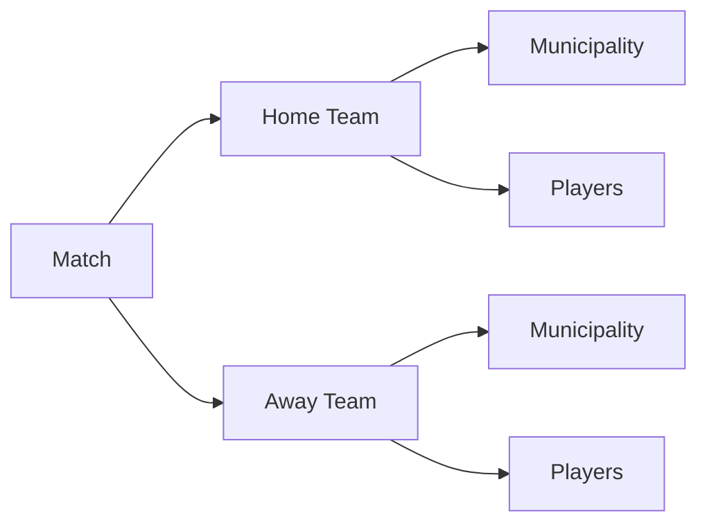

## Overview

Match management allows you to schedule games between registered teams, set match dates and times, and record scores for both home and away teams. The system tracks all matches in the tournament with complete details about participating teams and results.

<Note>
Creating, editing, and deleting matches requires authentication. Only logged-in users can manage match schedules.
</Note>

## Match Structure

Every match in the system contains:

- **Date and Time**: When the match is scheduled to take place
- **Home Team (Local)**: The team playing at their home venue
- **Away Team (Visitante)**: The visiting team
- **Home Score (Marcador Local)**: Goals scored by the home team (0-100)
- **Away Score (Marcador Visitante)**: Goals scored by the away team (0-100)

## Creating a New Match

<Steps>
  <Step title="Access the Create Match Page">
    Navigate to the Matches section and click "Create New Match" or similar action.
    
    **Requirement**: You must be logged in to access this page.
    
    **Prerequisite**: At least 2 teams must exist in the system to schedule a match.
  </Step>
  
  <Step title="Select Match Date and Time">
    Choose when the match will take place:
    
    - **Required**: Yes, date and time are mandatory
    - **Format**: DateTime field with date and time picker
    - **Validation**: Cannot be empty
    
    The system uses this to prevent duplicate matches and organize the schedule.
  </Step>
  
  <Step title="Select Home Team (Local)">
    Choose the team that will play at home:
    
    - Select from dropdown of all registered teams
    - This team's venue is considered the match location
    - Will be displayed as "Local" in match listings
  </Step>
  
  <Step title="Select Away Team (Visitante)">
    Choose the visiting team:
    
    - Select from dropdown of all registered teams
    - Can be any team except the home team
    - Will be displayed as "Visitante" in match listings
  </Step>
  
  <Step title="Enter Match Scores">
    Record the final scores for both teams:
    
    **Home Score (Marcador Local)**
    - Required field
    - Must be between 0 and 100
    - Numeric values only
    
    **Away Score (Marcador Visitante)**
    - Required field
    - Must be between 0 and 100
    - Numeric values only
    
    <Note>
    You can create matches with scores of 0-0 for scheduling future games, then edit to update scores after the match is played.
    </Note>
  </Step>
  
  <Step title="Validate and Submit">
    The system validates:
    - Date and time are provided
    - Both teams are selected
    - Scores are within valid range (0-100)
    - No duplicate match exists (same teams and exact date/time)
    
    On successful validation, the match is created and you're redirected to the Matches Index.
  </Step>
</Steps>

## Viewing Matches

The Matches Index page displays all scheduled matches:

### Match List Display

Each match shows:
- Date and time of the match
- Home team (Local) name
- Home team score
- Away team (Visitante) name
- Away team score
- Action buttons (View Details, Edit, Delete)

### Typical Display Format
```
Date/Time: March 15, 2026 - 3:00 PM
Local: Team A (2) vs Visitante: Team B (1)
```

## Editing Match Details

<Note>
Editing matches requires authentication.
</Note>

<Steps>
  <Step title="Select Match to Edit">
    From the Matches Index, click the "Edit" button next to the match you want to modify.
  </Step>
  
  <Step title="Review Current Information">
    The edit form displays:
    - Current date and time
    - Currently selected home team (pre-selected in dropdown)
    - Current home score
    - Currently selected away team (pre-selected in dropdown)
    - Current away score
  </Step>
  
  <Step title="Make Changes">
    You can modify any match attribute:
    
    <Tabs>
      <Tab title="Reschedule Match">
        Update the date and time to reschedule the game to a different slot.
      </Tab>
      
      <Tab title="Change Teams">
        Select different home or away teams from the dropdown menus.
      </Tab>
      
      <Tab title="Update Scores">
        Modify the scores after a match is played or to correct an entry error.
      </Tab>
      
      <Tab title="Complete Update">
        Change multiple fields at once (e.g., reschedule and update teams simultaneously).
      </Tab>
    </Tabs>
  </Step>
  
  <Step title="Duplicate Validation">
    The system checks for duplicate matches:
    - If another match exists with the same home team, away team, and exact date/time
    - If duplicate detected, you see an error message
    - Modify at least one field to make the match unique
  </Step>
  
  <Step title="Save Changes">
    Click submit to save updates. On success, you're redirected to the Matches Index with the updated information.
  </Step>
</Steps>

## Deleting Matches

<Warning>
Deleting a match permanently removes it from the system. This action cannot be undone.
</Warning>

<Steps>
  <Step title="Select Match">
    Find the match you want to remove in the Matches Index.
  </Step>
  
  <Step title="Initiate Deletion">
    Click the "Delete" button next to the match.
  </Step>
  
  <Step title="Handle Deletion">
    - **Success**: If deletion is allowed, the match is removed immediately
    - **Error**: If there are constraints preventing deletion, you'll see an error message (`ErrorEliminar = true`)
    
    The matches list refreshes to show remaining matches.
  </Step>
</Steps>

## Validation Rules

<Accordion title="Date and Time Validation">
  **Display Name**: "Fecha y hora del partido" (Match date and time)
  
  - **Required**: Yes
  - **Type**: DateTime
  - **Format**: Full date and time
  - **Null Handling**: Cannot be null or empty
  
  **Error Message**:
  - "La fecha del partido es obligatoria" (Match date is required)
</Accordion>

<Accordion title="Home Team (Local) Validation">
  - **Required**: Yes
  - **Type**: Foreign key reference to Team entity
  - **Selection**: Dropdown with all available teams
  - **Relationship**: One match has one home team
</Accordion>

<Accordion title="Home Score (Marcador Local) Validation">
  **Display Name**: "Marcador Local"
  
  - **Required**: Yes
  - **Type**: Integer
  - **Range**: 0 to 100
  - **Minimum**: 0 (no negative scores)
  - **Maximum**: 100 (upper limit for data integrity)
  
  **Error Messages**:
  - "El Marcador Local es obligatorio" (Home score is required)
  - "Marcador Local debe estar en un rango entre 0 y 100" (Score must be 0-100)
</Accordion>

<Accordion title="Away Team (Visitante) Validation">
  - **Required**: Yes
  - **Type**: Foreign key reference to Team entity
  - **Selection**: Dropdown with all available teams
  - **Relationship**: One match has one away team
</Accordion>

<Accordion title="Away Score (Marcador Visitante) Validation">
  **Display Name**: "Marcador Visitante"
  
  - **Required**: Yes
  - **Type**: Integer
  - **Range**: 0 to 100
  - **Minimum**: 0 (no negative scores)
  - **Maximum**: 100 (upper limit for data integrity)
  
  **Error Messages**:
  - "El Marcador Visitante es obligatoria" (Away score is required)
  - "Marcador Visitante debe estar en un rango entre 0 y 100" (Score must be 0-100)
</Accordion>

<Accordion title="Duplicate Match Validation">
  A match is considered duplicate if ALL of these match an existing match:
  - Same home team (Local)
  - Same away team (Visitante)
  - Same exact date and time
  
  This allows:
  - Same teams playing at different times
  - Different teams playing at the same time
  - Rematch between teams on different dates
</Accordion>

## Prerequisites for Creating Matches

<CardGroup cols={1}>
  <Card title="Minimum Two Teams Required" icon="users">
    At least 2 teams must be registered in the system before you can schedule a match.
    
    **Validation**: `equiposExits = equipos.Count() >= 2 ? true : false`
    
    If fewer than 2 teams exist, the creation page displays a warning and may disable match creation.
  </Card>
</CardGroup>

## Match Relationships



### Home Team Relationship
- **Property**: `Local`
- **Type**: Many-to-One
- **Description**: Many matches can have the same home team
- **Required**: Yes
- **Inverse Property**: Team has `PartidosLocal` collection

### Away Team Relationship
- **Property**: `Visitante`
- **Type**: Many-to-One
- **Description**: Many matches can have the same away team
- **Required**: Yes
- **Inverse Property**: Team has `PartidosVisitante` collection

## Common Workflows

<Tabs>
  <Tab title="Schedule Future Match">
    **Scenario**: Planning a match that hasn't been played yet
    
    1. Navigate to Matches > Create New
    2. Select future date and time
    3. Choose home team
    4. Choose away team
    5. Enter 0 for both scores (or leave as default)
    6. Submit form
    7. Match appears in schedule
    8. Edit later to update scores after match is played
  </Tab>
  
  <Tab title="Record Match Results">
    **Scenario**: Entering scores for a completed match
    
    1. Find the scheduled match in Matches Index
    2. Click Edit on the match
    3. Update home score (e.g., 3)
    4. Update away score (e.g., 2)
    5. Keep date/time and teams unchanged
    6. Submit form
    7. Match now shows final result
  </Tab>
  
  <Tab title="Reschedule Match">
    **Scenario**: Changing when a match will be played
    
    1. Navigate to Matches Index
    2. Click Edit on the match to reschedule
    3. Select new date and time
    4. Keep teams and scores unchanged
    5. System validates no duplicate exists
    6. Submit form
    7. Match shows new schedule
  </Tab>
  
  <Tab title="Create Match with Results">
    **Scenario**: Entering a completed match directly
    
    1. Navigate to Matches > Create New
    2. Select the date/time when match was played
    3. Choose home team
    4. Choose away team
    5. Enter actual final scores for both teams
    6. Submit form
    7. Match is created with complete information
  </Tab>
</Tabs>

## Score Range Explanation

The system allows scores from 0 to 100:

- **Typical Range**: Most soccer matches have scores between 0-10
- **Extended Range**: The 0-100 range accommodates:
  - Standard soccer matches
  - Aggregate scores (if tracking tournament totals)
  - Unusual high-scoring games
  - Data integrity and testing scenarios

<Note>
While the technical limit is 100, typical soccer matches rarely exceed single digits. The validation exists primarily for data integrity rather than reflecting common game outcomes.
</Note>

## Error Handling

<Accordion title="Duplicate Match Error">
  **Condition**: Creating or editing a match with same home team, away team, and date/time as existing match.
  
  **Result**:
  - `duplicate = true`
  - Error message displayed
  - Form redisplays with current input preserved
  - Team selections remain populated
  - User must modify teams or date/time to proceed
</Accordion>

<Accordion title="Insufficient Teams Error">
  **Condition**: Fewer than 2 teams exist in the system.
  
  **Result**:
  - `equiposExits = false`
  - Warning message displayed on creation page
  - Cannot create match until more teams are registered
  - User directed to create teams first
</Accordion>

<Accordion title="Validation Errors">
  **Condition**: Invalid input (missing date, scores out of range, etc.).
  
  **Result**:
  - `ModelState.IsValid = false`
  - Specific error messages for each invalid field
  - Form redisplays with user input
  - Dropdowns repopulated with available teams
</Accordion>

<Accordion title="Deletion Errors">
  **Condition**: Unable to delete match due to constraints.
  
  **Result**:
  - `ErrorEliminar = true`
  - Error message displayed in Matches Index
  - Match remains in system
  - Matches list refreshes to show all matches
</Accordion>

## Data Model

The match entity structure from the source code:

```csharp
public class Partido
{
    public int Id { get; set; }
    
    [Display(Name = "Fecha y hora del partido")]
    [Required(ErrorMessage = "La fecha del partido es obligatoria.")]
    public DateTime FechaHora { get; set; }
    
    public Equipo? Local { get; set; }
    
    [Display(Name = "Marcador Local")]
    [Required(ErrorMessage = "El Marcador Local es obligatorio.")]
    [Range(0, 100)]
    public int MarcadorLocal { get; set; }
    
    public Equipo? Visitante { get; set; }
    
    [Display(Name = "Marcador Visitante")]
    [Required(ErrorMessage = "El Marcador Visitante es obligatoria.")]
    [Range(0, 100)]
    public int MarcadorVisitante { get; set; }
}
```

## Team Match History

Each team maintains relationships to their matches:

```csharp
public class Equipo
{
    [InverseProperty("Local")]
    public List<Partido>? PartidosLocal { get; set; }
    
    [InverseProperty("Visitante")]
    public List<Partido>? PartidosVisitante { get; set; }
}
```

This allows tracking:
- All matches where a team played at home
- All matches where a team played away
- Complete match history for each team
- Team performance statistics

## Best Practices

<CardGroup cols={2}>
  <Card title="Schedule in Advance" icon="calendar-plus">
    Create matches with future dates and 0-0 scores, then update results after games are played.
  </Card>
  
  <Card title="Verify Teams" icon="check">
    Double-check you've selected the correct home and away teams before submitting.
  </Card>
  
  <Card title="Accurate Timing" icon="clock">
    Enter precise date and time to avoid scheduling conflicts and duplicate detection issues.
  </Card>
  
  <Card title="Update Promptly" icon="refresh">
    Record match results soon after games are completed for accurate tournament tracking.
  </Card>
</CardGroup>

## Related Documentation

<CardGroup cols={2}>
  <Card title="Team Management" icon="users" href="/features/team-management">
    Create and manage teams that participate in matches
  </Card>
  
  <Card title="Tournament Overview" icon="trophy" href="/features/tournament-management">
    Complete tournament management system guide
  </Card>
  
  <Card title="Player Management" icon="user" href="/features/player-management">
    Manage players on teams that compete in matches
  </Card>
  
  <Card title="Authentication" icon="shield" href="/features/user-authentication">
    Login requirements for match management
  </Card>
</CardGroup>