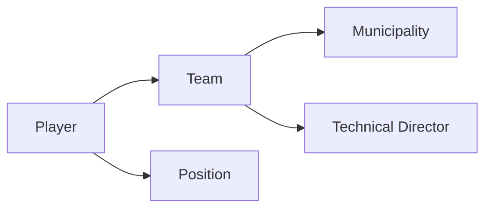

## Overview

Player management allows you to register individual athletes, assign them to teams, designate their playing positions, and manage their jersey numbers. Each player must be associated with a team and a position to participate in the tournament.

<Note>
Player creation, editing, and deletion require authentication. Only logged-in users can manage player rosters.
</Note>

## Player Structure

Every player in the system has the following attributes:

- **Player Name**: Full name of the athlete (3-50 characters, letters only)
- **Jersey Number**: Unique number on the team (1-99)
- **Team Assignment**: The team the player belongs to
- **Position**: The player's role on the field (e.g., Forward, Defender, Goalkeeper)

## Creating a New Player

<Steps>
  <Step title="Access the Create Player Page">
    Navigate to the Players section and click "Create New Player" or similar action.
    
    **Requirement**: You must be logged in to access this page.
  </Step>
  
  <Step title="Enter Player Information">
    Fill in all required fields:
    
    **Player Name**
    - Enter the player's full name
    - Only letters and spaces allowed
    - Must be 3-50 characters
    - Leading and trailing whitespace is automatically trimmed
    
    **Jersey Number**
    - Enter a number between 1 and 99
    - Must be numeric only
    - Each player needs a unique number within their position and team combination
    
    **Team Assignment**
    - Select from dropdown list of available teams
    - At least one team must exist in the system
    
    **Position**
    - Select the player's position from available options
    - At least one position must exist in the system
  </Step>
  
  <Step title="Duplicate Validation">
    The system checks for duplicate players based on:
    - Same name
    - Same jersey number
    - Same position
    - Same team
    
    If all four match an existing player, you'll see an error and must modify the information.
  </Step>
  
  <Step title="Submit & Confirm">
    Click submit to create the player. On success, you're redirected to the Players Index where the new player appears in the roster.
  </Step>
</Steps>

## Viewing Players

The Players Index page displays all registered players with their details:

- Player name
- Jersey number
- Team assignment
- Position
- Action buttons (View Details, Edit, Delete)

Players can be browsed in list format, making it easy to see complete rosters across all teams.

## Editing Player Information

<Note>
Editing players requires authentication.
</Note>

<Steps>
  <Step title="Select Player to Edit">
    From the Players Index, click the "Edit" button next to the player you want to modify.
  </Step>
  
  <Step title="Review Current Information">
    The edit form displays:
    - Current player name
    - Current jersey number
    - Currently assigned team (pre-selected in dropdown)
    - Current position (pre-selected in dropdown)
  </Step>
  
  <Step title="Make Changes">
    You can modify any of the player's attributes:
    
    <Tabs>
      <Tab title="Change Name">
        Update the player's name while maintaining validation rules (3-50 characters, letters only).
      </Tab>
      
      <Tab title="Change Jersey Number">
        Assign a different number (1-99). The system validates against duplicates on the same team/position.
      </Tab>
      
      <Tab title="Transfer to Different Team">
        Select a new team from the dropdown. The player's association is immediately updated.
      </Tab>
      
      <Tab title="Change Position">
        Select a new position from available options to reflect the player's new role.
      </Tab>
    </Tabs>
  </Step>
  
  <Step title="Validate & Save">
    The system performs the same duplicate validation as creation:
    - Checks if another player exists with the same name, number, position, and team
    - If validation passes, changes are saved
    - If duplicate detected, you see an error and can modify the input
    
    On successful update, you're redirected to the Players Index.
  </Step>
</Steps>

## Deleting Players

<Warning>
Deleting a player is permanent and cannot be undone. Ensure you want to remove the player before confirming deletion.
</Warning>

<Steps>
  <Step title="Select Player">
    Find the player you want to remove in the Players Index.
  </Step>
  
  <Step title="Initiate Deletion">
    Click the "Delete" button next to the player.
  </Step>
  
  <Step title="Confirm Deletion">
    The player is removed from the system and no longer appears in rosters.
  </Step>
</Steps>

## Validation Rules

The system enforces strict validation to maintain data quality:

<Accordion title="Player Name Validation">
  **Regular Expression**: `^(?![0-9]+$)[a-zA-ZÀ-ÿ\s]+$`
  
  - **Required**: Yes
  - **Minimum Length**: 3 characters
  - **Maximum Length**: 50 characters
  - **Allowed Characters**: Letters (including accented characters) and spaces
  - **Restriction**: Cannot contain numbers
  - **Processing**: Leading and trailing whitespace is trimmed automatically
  
  **Error Messages**:
  - "El nombre del Jugador es obligatorio" (Player name is required)
  - "El nombre del jugador no puede contener más de 50 caracteres" (Max 50 characters)
  - "El nombre del jugador no puede contener menos de 3 caracteres" (Min 3 characters)
  - "Valor Incorrecto. Solo se permiten letras" (Incorrect value. Only letters allowed)
</Accordion>

<Accordion title="Jersey Number Validation">
  **Regular Expression**: `^(?!a-zA-Z+$)[0-9]+$`
  
  - **Required**: Yes
  - **Allowed Characters**: Numbers only
  - **Range**: 1 to 99
  - **Type**: Integer
  
  **Error Messages**:
  - "El Número del Jugador es obligatorio" (Jersey number is required)
  - "El Número del Jugador debe estar en un rango entre 1 y 99" (Must be between 1-99)
  - "Valor Incorrecto. Solo se permiten numeros" (Incorrect value. Only numbers allowed)
</Accordion>

<Accordion title="Team Assignment Validation">
  - **Required**: Yes
  - **Type**: Foreign key reference to existing team
  - **Prerequisite**: At least one team must exist
  - **Selection Method**: Dropdown menu with all available teams
</Accordion>

<Accordion title="Position Validation">
  - **Required**: Yes
  - **Type**: Foreign key reference to existing position
  - **Prerequisite**: At least one position must exist
  - **Selection Method**: Dropdown menu with all available positions
  - **Examples**: Goalkeeper, Defender, Midfielder, Forward
</Accordion>

<Accordion title="Duplicate Player Validation">
  A player is considered duplicate if ALL of these match an existing player:
  - Same name (exact match)
  - Same jersey number
  - Same position
  - Same team
  
  This allows:
  - Same name on different teams
  - Same number in different positions
  - Same name in different positions on the same team
</Accordion>

## Prerequisites for Creating Players

Before adding players, ensure these entities exist:

<CardGroup cols={2}>
  <Card title="Teams" icon="users">
    At least one team must be registered to assign players.
    
    If no teams exist, the creation page displays a warning: `equipoExits = false`
  </Card>
  
  <Card title="Positions" icon="map">
    At least one position must be defined in the system.
    
    If no positions exist, the creation page displays a warning: `posicionesExits = false`
  </Card>
</CardGroup>

## Player Relationships



### Team Relationship
- **Type**: Many-to-One
- **Description**: Many players belong to one team
- **Required**: Yes
- **Cardinality**: Each player must have exactly one team

### Position Relationship
- **Type**: Many-to-One
- **Description**: Many players can have the same position
- **Required**: Yes
- **Cardinality**: Each player must have exactly one position

## Common Workflows

<Tabs>
  <Tab title="Add Player to Team">
    **Scenario**: Registering a new player for a team
    
    1. Ensure team and positions exist in system
    2. Navigate to Players > Create New
    3. Enter player name (e.g., "Juan Martinez")
    4. Enter jersey number (e.g., 10)
    5. Select team from dropdown
    6. Select position (e.g., "Midfielder")
    7. Submit form
    8. Player appears in Players Index
  </Tab>
  
  <Tab title="Transfer Player to New Team">
    **Scenario**: Moving a player from one team to another
    
    1. Navigate to Players Index
    2. Find the player to transfer
    3. Click Edit
    4. Select new team from dropdown
    5. Keep name, number, and position unchanged (or modify if needed)
    6. Submit form
    7. Player now associated with new team
  </Tab>
  
  <Tab title="Change Player Position">
    **Scenario**: Updating a player's role on the team
    
    1. Navigate to Players Index
    2. Click Edit on the player
    3. Select new position from dropdown
    4. Keep other fields unchanged
    5. Submit form
    6. Player's position is updated
  </Tab>
  
  <Tab title="Update Jersey Number">
    **Scenario**: Assigning a new number to a player
    
    1. Navigate to Players Index
    2. Click Edit on the player
    3. Enter new jersey number (1-99)
    4. System validates for duplicates
    5. Submit form
    6. Number is updated if no conflicts
  </Tab>
</Tabs>

## Position Management

Positions are predefined entities in the system that categorize player roles:

### Position Attributes
- **Position Name**: 3-30 characters (letters only)
- **Players**: List of all players assigned to this position

### Position Validation
```csharp
[RegularExpression(@"^(?![0-9]+$)[a-zA-ZÀ-ÿ\s]+$")]
[Required(AllowEmptyStrings=false)]
[MaxLength(30)]
[MinLength(3)]
```

### Common Position Types
Typical positions in soccer tournaments include:
- Goalkeeper (Arquero)
- Defender (Defensa)
- Midfielder (Mediocampista)
- Forward (Delantero)

## Error Handling

<Accordion title="Duplicate Player Error">
  **Condition**: When creating/editing a player with name, number, position, and team that exactly match an existing player.
  
  **Result**: 
  - `duplicate = true`
  - Form redisplays with error message
  - Input is preserved for user correction
  - User must modify at least one of the four attributes
</Accordion>

<Accordion title="Missing Prerequisites Error">
  **Condition**: No teams or positions exist in the system.
  
  **Result**:
  - `equipoExits = false` or `posicionesExits = false`
  - Warning message displayed on page
  - Form may be disabled until prerequisites are created
  - User directed to create teams or positions first
</Accordion>

<Accordion title="Validation Errors">
  **Condition**: Input doesn't meet validation rules (e.g., name too short, number out of range).
  
  **Result**:
  - `ModelState.IsValid = false`
  - Specific error messages displayed for each invalid field
  - Form redisplays with user input preserved
  - Dropdowns remain populated with available options
</Accordion>

<Accordion title="General Exception Handling">
  **Condition**: Unexpected errors during creation, update, or deletion.
  
  **Result**:
  - Exception caught in try-catch block
  - Error logged to console
  - User returned to form with data preserved
  - Available teams and positions reloaded
</Accordion>

## Data Model

The player entity structure from the source code:

```csharp
public class Jugador
{
    public int Id { get; set; }
    
    [Display(Name = "Nombre del Jugador")]
    [Required(ErrorMessage = "El nombre del Jugador es obligatorio.")]
    [MaxLength(50), MinLength(3)]
    public string Nombre { get; set; }
    
    [Display(Name = "Número del Jugador")]
    [Required(ErrorMessage = "El Número del Jugador es obligatorio.")]
    [Range(1, 99)]
    public int Numero { get; set; }
    
    public Equipo? Equipo { get; set; }
    public Posicion? Posicion { get; set; }
}
```

## Best Practices

<CardGroup cols={2}>
  <Card title="Unique Jersey Numbers" icon="hashtag">
    While the system allows same numbers for different positions, assign unique numbers per team for clarity.
  </Card>
  
  <Card title="Consistent Naming" icon="text">
    Use full names with proper capitalization for professional appearance.
  </Card>
  
  <Card title="Position Assignment" icon="map">
    Assign positions based on player's primary role for accurate team organization.
  </Card>
  
  <Card title="Regular Updates" icon="refresh">
    Keep player information current, especially when transfers or position changes occur.
  </Card>
</CardGroup>

## Related Documentation

<CardGroup cols={2}>
  <Card title="Team Management" icon="users" href="/features/team-management">
    Learn how to create and manage teams for player assignment
  </Card>
  
  <Card title="Tournament Overview" icon="trophy" href="/features/tournament-management">
    Complete tournament management system guide
  </Card>
  
  <Card title="Match Management" icon="calendar" href="/features/match-management">
    Schedule matches with your registered players
  </Card>
  
  <Card title="Authentication" icon="shield" href="/features/user-authentication">
    Login requirements for player management
  </Card>
</CardGroup>