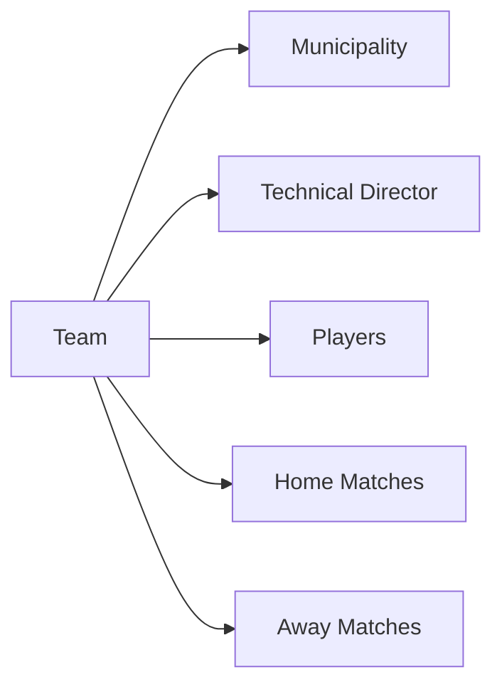

## Overview

Team management is a core feature that allows you to register and organize teams participating in the tournament. Each team is associated with a municipality, led by a technical director, and contains a roster of players.

<Note>
You must be logged in to create, edit, or delete teams. Viewing teams is available to all users.
</Note>

## Team Structure

Every team in the system consists of:

- **Team Name**: Unique identifier for the team (3-50 characters)
- **Municipality**: Geographic location the team represents
- **Technical Director**: The coach leading the team
- **Player Roster**: List of players assigned to the team
- **Match History**: All matches played as home or away team

## Creating a New Team

<Steps>
  <Step title="Access the Create Team Page">
    Navigate to the Teams section and click "Create New Team" or similar action button.
    
    **Prerequisites**: You must be logged in with a valid account.
  </Step>
  
  <Step title="Enter Team Information">
    Fill in the required team details:
    
    - **Team Name**: Enter a unique name (3-50 characters, letters and spaces allowed)
    - **Municipality**: Select from the dropdown list of available municipalities
    - **Technical Director**: Choose a technical director from the available coaches
    
    <Note>
    If no municipalities or technical directors are available, you'll need to create them first before adding a team.
    </Note>
  </Step>
  
  <Step title="Validate Input">
    The system automatically validates your input:
    
    - Team name must be unique (no duplicates)
    - Name cannot consist only of numbers
    - Name must be between 3-50 characters
    - Municipality and technical director must be selected
  </Step>
  
  <Step title="Submit & Confirm">
    Click the submit button to create the team. If successful, you'll be redirected to the teams index page where your new team appears in the list.
    
    If there are validation errors, you'll see specific error messages indicating what needs to be corrected.
  </Step>
</Steps>

## Viewing Teams

The Teams Index page provides multiple ways to browse and find teams:

### List View

All teams are displayed in a list format showing:
- Team name
- Municipality
- Technical director
- Action buttons (View Details, Edit, Delete)

### Filtering by Municipality

<Steps>
  <Step title="Select Municipality">
    Use the municipality dropdown filter at the top of the teams list.
  </Step>
  
  <Step title="View Filtered Results">
    The page refreshes to show only teams from the selected municipality.
  </Step>
  
  <Step title="Clear Filter">
    Select "All" or the default option to view teams from all municipalities.
  </Step>
</Steps>

### Search by Name

<Steps>
  <Step title="Enter Search Term">
    Type the team name (or partial name) in the search box.
  </Step>
  
  <Step title="Submit Search">
    Click the search button to filter results.
  </Step>
  
  <Step title="View Results">
    Teams matching your search criteria are displayed. Clear the search box to view all teams again.
  </Step>
</Steps>

## Editing Team Details

<Note>
Editing teams requires authentication.
</Note>

<Steps>
  <Step title="Select Team to Edit">
    From the Teams Index page, click the "Edit" button next to the team you want to modify.
  </Step>
  
  <Step title="Update Information">
    The edit form displays current team information with the ability to modify:
    
    - Team name
    - Municipality assignment
    - Technical director assignment
    
    The original values are pre-selected in dropdown menus for easy reference.
  </Step>
  
  <Step title="Duplicate Detection">
    If you change the team name, the system checks for duplicates:
    
    - If the name is unchanged, the update proceeds without duplicate validation
    - If the name changes, it must not match any existing team name
  </Step>
  
  <Step title="Save Changes">
    Click submit to save your changes. On success, you're redirected to the Teams Index page with the updated information.
  </Step>
</Steps>

## Deleting Teams

<Warning>
Deleting a team is a permanent action. Teams involved in scheduled matches may not be deletable due to referential integrity.
</Warning>

<Steps>
  <Step title="Select Team">
    Find the team you want to delete in the Teams Index.
  </Step>
  
  <Step title="Initiate Deletion">
    Click the "Delete" button next to the team.
  </Step>
  
  <Step title="Handle Constraints">
    - **Success**: If the team has no dependencies (no scheduled matches, no players), it's deleted immediately
    - **Error**: If the team is referenced in matches or has players, you'll see an error message. You must remove these dependencies first.
  </Step>
</Steps>

## Validation Rules

The system enforces the following rules when creating or editing teams:

<Accordion title="Team Name Validation">
  **Regular Expression**: `^(?![0-9]+$)[a-zA-ZÀ-ÿ\d\s]+$`
  
  - **Required**: Yes
  - **Minimum Length**: 3 characters
  - **Maximum Length**: 50 characters
  - **Allowed Characters**: Letters (including accented characters), numbers, and spaces
  - **Restriction**: Cannot be only numbers
  - **Uniqueness**: No duplicate team names allowed
  
  **Error Messages**:
  - "El nombre del Equipo es obligatorio" (Team name is required)
  - "El nombre del equipo no puede contener más de 50 caracteres" (Max 50 characters)
  - "El nombre del equipo no puede contener menos de 3 caracteres" (Min 3 characters)
  - "Valor Incorrecto. Solo se permiten letras" (Incorrect value. Only letters allowed)
</Accordion>

<Accordion title="Municipality Assignment">
  - **Required**: Yes
  - **Validation**: Must select an existing municipality from the dropdown
  - **Prerequisite**: At least one municipality must exist in the system
</Accordion>

<Accordion title="Technical Director Assignment">
  - **Required**: Yes
  - **Validation**: Must select an existing technical director from the dropdown
  - **Prerequisite**: At least one technical director must exist in the system
</Accordion>

## Prerequisites for Creating Teams

Before you can create teams, ensure the following entities exist in the system:

<CardGroup cols={2}>
  <Card title="Municipalities" icon="map-pin">
    At least one municipality must be registered to assign teams to geographic locations.
  </Card>
  
  <Card title="Technical Directors" icon="user-tie">
    At least one technical director must be registered to lead the team.
  </Card>
</CardGroup>

If these prerequisites are not met, the team creation page will display a warning message indicating what needs to be created first.

## Team Relationships

Teams maintain relationships with several other entities:

### Municipality Relationship
- **Type**: Many-to-One
- **Description**: Many teams can belong to one municipality
- **Required**: Yes

### Technical Director Relationship
- **Type**: Many-to-One
- **Description**: Many teams can have the same technical director
- **Required**: Yes

### Players Relationship
- **Type**: One-to-Many
- **Description**: One team has multiple players
- **Impact on Deletion**: Teams with players may have deletion restrictions

### Matches Relationship
- **Type**: One-to-Many (dual)
- **Description**: Teams participate as either home (local) or away (visitante) in matches
- **Impact on Deletion**: Teams with scheduled matches cannot be deleted

## Common Workflows

<Tabs>
  <Tab title="Register New Team">
    **Scenario**: Adding a new team to the tournament
    
    1. Ensure municipality and technical director exist
    2. Navigate to Teams > Create New
    3. Enter team name
    4. Select municipality from dropdown
    5. Select technical director from dropdown
    6. Submit form
    7. Team appears in Teams Index
  </Tab>
  
  <Tab title="Change Team Coach">
    **Scenario**: Assigning a new technical director to a team
    
    1. Navigate to Teams Index
    2. Click Edit on the desired team
    3. Select new technical director from dropdown
    4. Keep other fields unchanged
    5. Submit form
    6. Team now shows new technical director
  </Tab>
  
  <Tab title="Move Team to Different Municipality">
    **Scenario**: Changing the geographic location a team represents
    
    1. Navigate to Teams Index
    2. Click Edit on the team
    3. Select new municipality from dropdown
    4. Submit form
    5. Team now associated with new municipality
    6. Can filter by new municipality to verify
  </Tab>
  
  <Tab title="Find Teams by Location">
    **Scenario**: Viewing all teams from a specific municipality
    
    1. Navigate to Teams Index
    2. Use municipality filter dropdown
    3. Select desired municipality
    4. Page shows only teams from that location
    5. Select "All" to clear filter
  </Tab>
</Tabs>

## Error Handling

The system provides clear feedback when operations fail:

### Duplicate Team Name
If you try to create a team with a name that already exists, you'll see an error message and remain on the creation page with your input preserved.

### Missing Prerequisites
If municipalities or technical directors don't exist, the creation page displays a warning and may disable the submit button until prerequisites are met.

### Deletion Errors
When attempting to delete a team that has dependencies (players or matches), an error flag is set and displayed: "ErrorEliminar = true". You'll need to remove dependencies before deletion.

### Validation Errors
Each field displays specific error messages when validation fails, guiding you to correct the input.

## Related Documentation

<CardGroup cols={2}>
  <Card title="Player Management" icon="user" href="/features/player-management">
    Learn how to add players to your teams
  </Card>
  
  <Card title="Match Management" icon="calendar" href="/features/match-management">
    Schedule matches between teams
  </Card>
  
  <Card title="Tournament Overview" icon="trophy" href="/features/tournament-management">
    Complete tournament management guide
  </Card>
  
  <Card title="Authentication" icon="shield" href="/features/user-authentication">
    Login requirements for team management
  </Card>
</CardGroup>