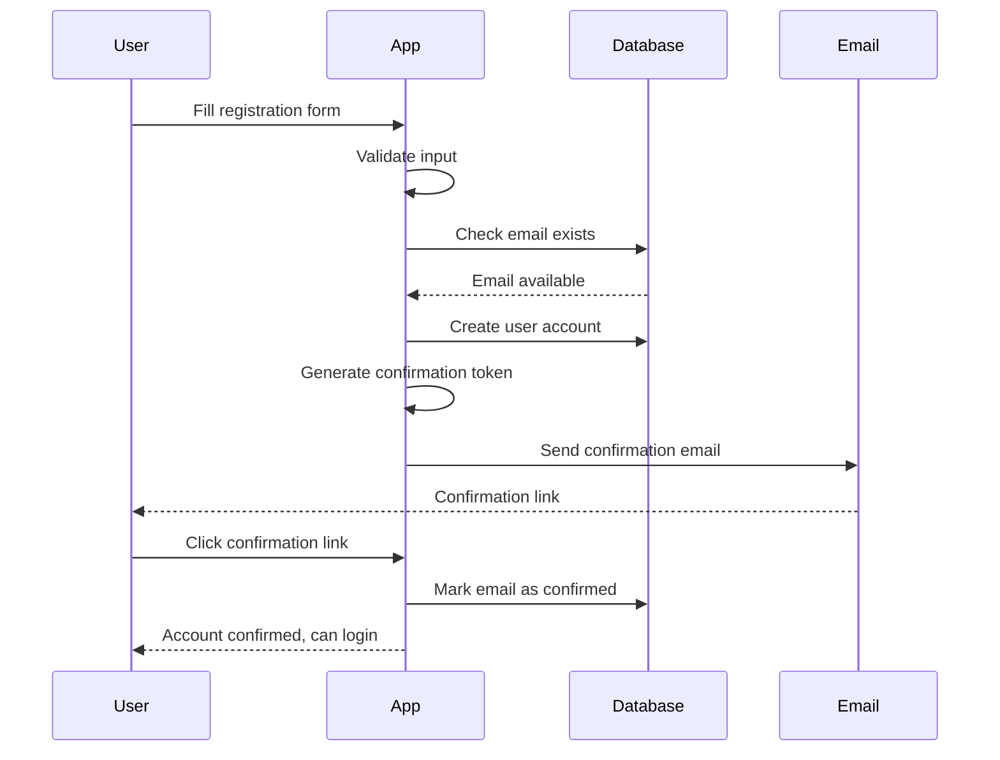
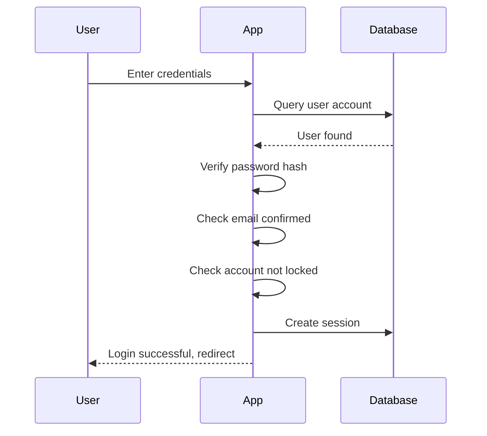

## Overview

The Tournament Management App uses ASP.NET Core Identity for secure user authentication and authorization. This system protects tournament management features and ensures only authorized users can create, modify, or delete tournament data.

## Authentication System

The application implements Microsoft's ASP.NET Core Identity framework, providing:

- User registration and account creation
- Secure login with password hashing
- Email confirmation for new accounts
- Account lockout protection against brute-force attacks
- Session management
- User role-based authorization

## Database Configuration

The authentication system uses SQLite for user data storage:

```csharp
var connectionString = Environment.GetEnvironmentVariable("DATABASE_CONNECTION_STRING") 
    ?? "Data Source=/app/Torneo.db";
    
builder.Services.AddDbContext<IdentityDataContext>(
    options => options.UseSqlite(connectionString)
);
```

**Key Components**:
- **IdentityDataContext**: EF Core database context for Identity tables
- **SQLite Database**: Stores user accounts, passwords, and authentication data
- **Environment Variable Support**: Configurable connection string via `DATABASE_CONNECTION_STRING`

## User Registration

<Steps>
  <Step title="Access Registration Page">
    Navigate to the registration page (typically `/Identity/Account/Register`).
    
    No authentication required to access this page.
  </Step>
  
  <Step title="Enter Account Information">
    Fill in the registration form with required details:
    
    **Email Address (Correo electrónico)**
    - Required field
    - Must be valid email format
    - Used as username in the system
    - Cannot be an email already registered
    
    **Password (Contraseña)**
    - Minimum 6 characters
    - Maximum 100 characters
    - Must meet complexity requirements (see Password Policy below)
    
    **Confirm Password (Confirmar contraseña)**
    - Must exactly match the password field
    - Prevents typos during registration
  </Step>
  
  <Step title="Submit Registration">
    The system validates your input:
    
    - Checks if email is already in use
    - Validates password meets security requirements
    - Ensures password confirmation matches
    
    If validation passes, your account is created.
  </Step>
  
  <Step title="Email Confirmation">
    After successful registration:
    
    1. A confirmation email is sent to your address
    2. Email contains a confirmation link
    3. Click the link to confirm your account
    4. Account confirmation is **required** before you can log in
    
    <Note>
    The system is configured with `RequireConfirmedAccount = true`, meaning you must confirm your email before accessing protected features.
    </Note>
  </Step>
</Steps>

## User Login

<Steps>
  <Step title="Access Login Page">
    Navigate to the login page (typically `/Identity/Account/Login`).
  </Step>
  
  <Step title="Enter Credentials">
    Provide your registered credentials:
    - Email address (used as username)
    - Password
  </Step>
  
  <Step title="Authenticate">
    The system verifies:
    - Account exists
    - Email is confirmed
    - Password is correct
    - Account is not locked out
    
    On successful authentication, you're logged in and redirected to the home page or your requested destination.
  </Step>
</Steps>

## Password Policy

The application enforces strict password requirements for security:

<Accordion title="Password Complexity Requirements">
  Configured in `Program.cs`:
  
  ```csharp
  options.Password.RequireDigit = true;
  options.Password.RequireLowercase = true;
  options.Password.RequireNonAlphanumeric = true;
  options.Password.RequireUppercase = true;
  options.Password.RequiredLength = 6;
  options.Password.RequiredUniqueChars = 1;
  ```
  
  **Requirements**:
  - **Minimum Length**: 6 characters
  - **Requires Digit**: At least one number (0-9)
  - **Requires Lowercase**: At least one lowercase letter (a-z)
  - **Requires Uppercase**: At least one uppercase letter (A-Z)
  - **Requires Non-Alphanumeric**: At least one special character (!@#$%^&*, etc.)
  - **Unique Characters**: At least 1 unique character
  
  **Example Valid Passwords**:
  - `Password123!`
  - `MyTorneo2026#`
  - `Secure@Pass1`
  
  **Example Invalid Passwords**:
  - `password` (no uppercase, digit, or special char)
  - `Pass1!` (too short, only 6 chars but missing complexity)
  - `PASSWORD123!` (no lowercase)
</Accordion>

## Account Lockout Protection

The system protects against brute-force attacks with automatic account lockout:

```csharp
options.Lockout.DefaultLockoutTimeSpan = TimeSpan.FromMinutes(5);
options.Lockout.MaxFailedAccessAttempts = 5;
options.Lockout.AllowedForNewUsers = true;
```

**Lockout Settings**:
- **Failed Attempts Limit**: 5 consecutive failed login attempts
- **Lockout Duration**: 5 minutes
- **Applies To**: All users including newly registered accounts

<Warning>
After 5 failed login attempts, your account is locked for 5 minutes. Wait for the lockout period to expire before attempting to log in again.
</Warning>

## Authorization Levels

The application uses two authorization levels:

### Anonymous Access (No Login Required)

Users can view tournament data without authentication:
- Browse teams
- View players
- See match schedules and results
- View technical directors and municipalities

### Authenticated Access (Login Required)

The `[Authorize]` attribute protects management features:

**Protected Pages**:
- Team creation, editing, and deletion (`Pages/Equipos/Create`, `Edit`)
- Player management (`Pages/Jugadores/Create`, `Edit`)
- Match scheduling and editing (`Pages/Partidos/Create`, `Edit`)
- Technical director management (`Pages/DTs/Create`, `Edit`)

**Code Example**:
```csharp
[Authorize]
public class CreateModel : PageModel
{
    // Only authenticated users can access this page
}
```

## Identity Configuration

The authentication system is configured in `Program.cs`:

```csharp
builder.Services.AddDefaultIdentity<IdentityUser>(
    options => options.SignIn.RequireConfirmedAccount = true
).AddEntityFrameworkStores<IdentityDataContext>();
```

**Key Settings**:
- **User Type**: `IdentityUser` (standard ASP.NET Core Identity user)
- **Email Confirmation**: Required (`RequireConfirmedAccount = true`)
- **Store**: Entity Framework Core with SQLite database
- **Framework**: ASP.NET Core Identity (default implementation)

## Data Protection

User data and authentication tokens are protected using ASP.NET Core Data Protection:

```csharp
builder.Services.AddDataProtection()
    .PersistKeysToDbContext<IdentityDataContext>()
    .SetApplicationName("TorneoApp");
```

**Features**:
- **Key Persistence**: Encryption keys stored in database
- **Application Name**: "TorneoApp" (ensures keys are application-specific)
- **Purpose**: Protects cookies, tokens, and sensitive data

<Note>
Data protection keys are persisted to the database context, ensuring they survive application restarts and work in multi-server deployments.
</Note>

## Registration Process Flow



## Login Process Flow



## Common Authentication Errors

<Accordion title="Email Already in Use">
  **Error**: "El correo electrónico ya está en uso."
  
  **Cause**: The email address is already registered in the system.
  
  **Solution**: 
  - Use a different email address
  - Or log in with existing account if you already registered
  - Or use password recovery if you forgot your password
</Accordion>

<Accordion title="Passwords Don't Match">
  **Error**: "Las contraseñas no coinciden."
  
  **Cause**: Password and Confirm Password fields don't match exactly.
  
  **Solution**: 
  - Carefully re-enter both password fields
  - Ensure no extra spaces or typos
  - Make both fields identical
</Accordion>

<Accordion title="Password Too Weak">
  **Error**: "La contraseña debe tener entre 6 y 100 caracteres."
  
  **Cause**: Password doesn't meet complexity requirements.
  
  **Solution**: 
  - Use at least 6 characters
  - Include uppercase letter (A-Z)
  - Include lowercase letter (a-z)
  - Include digit (0-9)
  - Include special character (!@#$%^&*)
</Accordion>

<Accordion title="Account Locked Out">
  **Cause**: Too many failed login attempts (5 or more).
  
  **Solution**: 
  - Wait 5 minutes for lockout to expire
  - Verify you're using the correct password
  - Consider using password recovery if you've forgotten credentials
</Accordion>

<Accordion title="Email Not Confirmed">
  **Cause**: Trying to log in before confirming email address.
  
  **Solution**: 
  - Check your email inbox for confirmation message
  - Click the confirmation link in the email
  - Check spam/junk folder if email not found
  - Request new confirmation email if needed
</Accordion>

## Security Features

<CardGroup cols={2}>
  <Card title="Password Hashing" icon="lock">
    Passwords are never stored in plain text. ASP.NET Core Identity uses industry-standard hashing algorithms.
  </Card>
  
  <Card title="HTTPS Redirection" icon="shield-check">
    The application enforces HTTPS in production to encrypt data in transit.
  </Card>
  
  <Card title="Anti-Forgery Tokens" icon="shield-halved">
    Forms are protected with anti-forgery tokens to prevent CSRF attacks.
  </Card>
  
  <Card title="Session Management" icon="clock">
    Secure session handling with configurable timeout and cookie settings.
  </Card>
</CardGroup>

## Health Checks

The application includes health monitoring for the authentication database:

```csharp
builder.Services.AddHealthChecks()
    .AddSqlite(connectionString, name: "database", 
               failureStatus: HealthStatus.Unhealthy);
```

**Endpoint**: `/health`

**Purpose**: 
- Monitor database connectivity
- Verify authentication system is operational
- Support deployment health checks

## Logout

Users can log out to end their authenticated session:

1. Click the logout link in the navigation
2. Session is terminated
3. Authentication cookie is cleared
4. User is redirected to home page
5. Must log in again to access protected features

## Future Authentication Features

The codebase includes commented-out configuration for external authentication providers:

```csharp
// Planned for future implementation:
// - Google OAuth
// - Facebook Login
// - Microsoft Account
```

These features are prepared but not currently active in the system.

## Best Practices

<CardGroup cols={2}>
  <Card title="Strong Passwords" icon="key">
    Use unique, complex passwords that meet all requirements. Consider a password manager.
  </Card>
  
  <Card title="Confirm Email Promptly" icon="envelope-circle-check">
    Check your email and confirm your account immediately after registration.
  </Card>
  
  <Card title="Logout When Done" icon="right-from-bracket">
    Always log out when finished managing tournament data, especially on shared computers.
  </Card>
  
  <Card title="Avoid Failed Attempts" icon="triangle-exclamation">
    Be careful entering credentials to avoid triggering account lockout.
  </Card>
</CardGroup>

## Related Documentation

<CardGroup cols={2}>
  <Card title="Team Management" icon="users" href="/features/team-management">
    Requires authentication to create and edit teams
  </Card>
  
  <Card title="Player Management" icon="user" href="/features/player-management">
    Requires authentication to manage player rosters
  </Card>
  
  <Card title="Match Management" icon="calendar" href="/features/match-management">
    Requires authentication to schedule and edit matches
  </Card>
  
  <Card title="Tournament Overview" icon="trophy" href="/features/tournament-management">
    Overview of all features and their access requirements
  </Card>
</CardGroup>